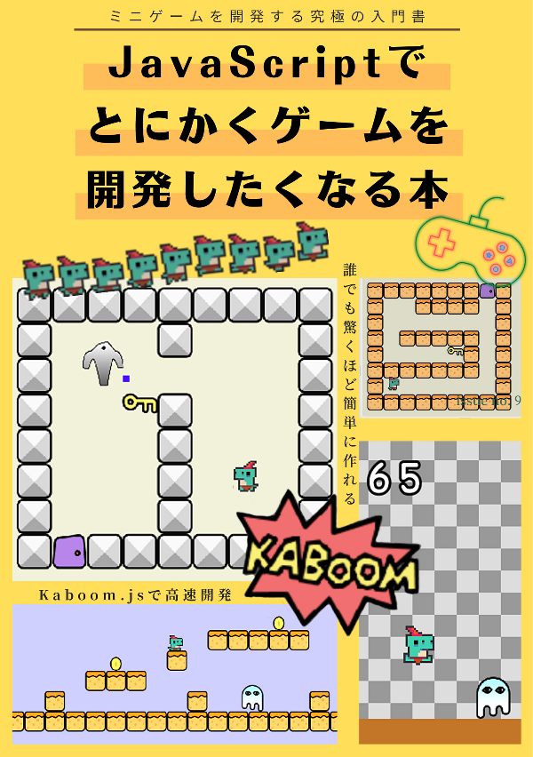

# JavaScriptでとにかくゲームを開発したくなる本

## 本書について

- JavaScriptでWebゲームを作りたいけど途中で挫折してしまった
- いろんなジャンルのミニゲームをたくさん作りたいと考えている
- 面倒な初期設定や環境構築などを無視してすぐにでもゲームを作りたい

本書は上記のような想いをもった方ならピッタリのゲーム開発入門書になります。ごく普通のJavaScriptをベースにしてゲームを開発する本なのですが、初心者でも挫折しないように難しい概念や計算などをうまく吸収してくれるJavaScriptライブラリのKaboom.jsを組み合わせた日本で唯一の解説書となります。

UnityやUnreal Engineなどを使った本格的なゲーム開発には向きませんが、もっとお手軽でカジュアルなゲーム、小さなミニゲームなどを作ることにフォーカスすれば、本書は究極の入門書になると信じています。

開発環境もブラウザ上に構築するので、本書が1冊あれば今すぐにでもゲーム開発を始めることができます。もちろんご自身の使い慣れた環境でもゲーム開発を始められるうえ、最終的にHTMLファイル1つあれば動作するゲームを作れます。

ジャンプゲーム、マリオ風アクションゲーム、ミニRPGゲームなどを開発できる独自のノウハウを本書に詰め込みましたので、ぜひみなさんも楽しみながらユニークなゲームを作ってシェアしてください。

★販売ページ：https://masatolan.booth.pm/items/3636186

## 対象読者

- HTML/CSS/JavaScriptの基本が分かる人
- ゲーム開発は初心者だけど独自のゲームを作りたい人
- 世界中の人に自分の開発したゲームを遊んで欲しいと思っている人

## 目次

- はじめに
- 目次
- １章　Kaboom.jsとは
  - １.１ どんなゲームが作れるのか
  - １.２ ゲームの開発環境について
  - １.３ 便利なコンポーネントシステム
  - １.４ マップ作成機能
  - １.５ ゲーム画面の録画機能
  - １.６ 公式ドキュメントの使い方
- ２章　ゲーム開発の基礎知識
  - ２.１ Kaboom.jsの導入
  - ２.２ ゲームオブジェクトの作り方
  - ２.３ イベント処理の制御
  - ２.４ 移動アニメーション
  - ２.５ ゲームシーンの切り替え方
  - ２.６ デバッグモードについて
- ３章　簡単なジャンプゲームの作り方
  - ３.１ ゲームの全体像
  - ３.２ ゲームオブジェクトを作ろう
  - ３.３ 障害物を関数にまとめる
  - ３.４ プレイヤーをジャンプさせる
  - ３.５ 当たり判定を作る
  - ３.６ ゲームを完成させる
- ４章　スプライトの使い方
  - ４.１ 画像データの読み込み方
  - ４.２ アニメーションについて
  - ４.３ 複雑な画像データを読み込む
  - ４.４ ジャンプゲームをスプライト化する
- ５章　アクションゲームの作り方
  - ５.１ ゲームの全体像
  - ５.２ ゲームオブジェクトを作ろう
  - ５.３ プレイヤーの制御
  - ５.４ ステージを構築しよう
  - ５.５ カスタムコンポーネントの作成
  - ５.６ ゲームを完成させる
- ６章　ミニRPGゲーム
  - ６.１ ゲームの全体像
  - ６.２ ゲームオブジェクトを作ろう
  - ６.３ 複数のステージを連携する
  - ６.４ プレイヤーの制御
  - ６.５ ステートマシンで敵の行動を制御
  - ６.６ ゲームを完成させる
  - ６.７ ゲームファイルの分割について
- ７章　ゲームをもっと楽しむために
  - ７.１ ゲームの録画機能を実装する
  - ７.２ ゲームを公開しよう
- 付録
- 著者紹介

## サポートサイトについて

本書に掲載しているサンプルコードやダウンロードファイルなどをすべてまとめています。

ソースコードは独自プロジェクト、勉強会などなど…自由にご利用頂いて問題ありません。

## 最新情報・誤植

